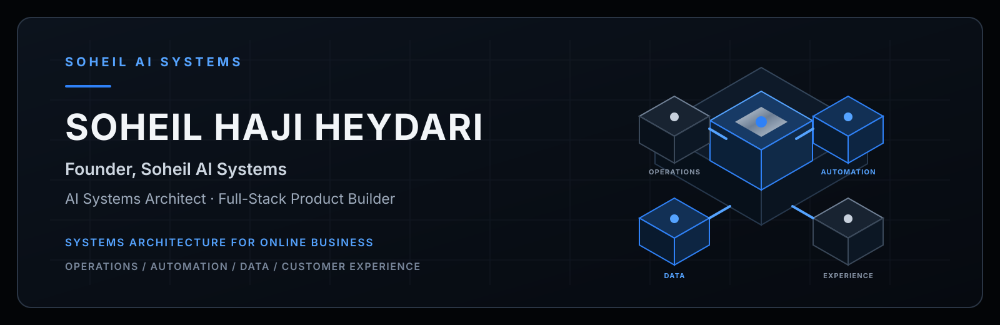
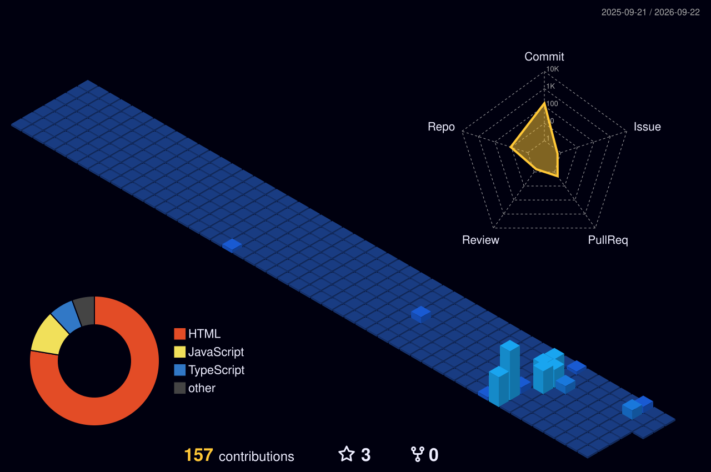

  

<h1 align="center">SOHEIL HAJI HEYDARI</h1>

  <strong>Founder, Soheil AI Systems</strong> 
  AI Systems Architect · Full-Stack Product Builder

  I design intelligent systems that connect business operations, automation, data and customer experience.

  برای کسب‌وکارهای آنلاین، سیستم می‌سازم؛ نه ابزارهای پراکنده.

  
  
  
  
  
  

## Core Positioning — جایگاه حرفه‌ای

I build end-to-end systems for online businesses. The work starts with understanding how an operation creates value, where information moves, what slows the team down and which decisions need better data—not with a predetermined technology stack.

برای کسب‌وکارهای آنلاین، سیستم‌های یکپارچه طراحی و پیاده‌سازی می‌کنم. کار از شناخت مدل عملیاتی کسب‌وکار، مسیر حرکت اطلاعات، نقاط اتلاف زمان و تصمیم‌هایی که به دادهٔ دقیق‌تر نیاز دارند شروع می‌شود؛ نه از انتخاب زودهنگام یک فناوری.

From that operating model, I design the software architecture and deliver the connected product: backend services, user-facing platforms, automation, AI-assisted workflows, data pipelines and deployment infrastructure. The result is a coherent system that can be measured, maintained and extended.

بر اساس این مدل عملیاتی، معماری نرم‌افزار و محصول متصل به آن را می‌سازم: سرویس‌های بک‌اند، پلتفرم‌های کاربرمحور، اتوماسیون، گردش‌کارهای مجهز به هوش مصنوعی، پردازش داده و زیرساخت استقرار. خروجی، سیستمی منسجم، قابل‌اندازه‌گیری، قابل‌نگهداری و قابل‌توسعه است.

## Systems I Build — سیستم‌هایی که می‌سازم

### Intelligent Business Automation

Systems that reduce repetitive work, coordinate handoffs and connect fragmented operational processes into one dependable workflow.

<strong>اتوماسیون هوشمند کسب‌وکار</strong> 
سیستم‌هایی برای کاهش کارهای تکراری، هماهنگ‌کردن تحویل وظایف و اتصال فرایندهای پراکنده در یک گردش‌کار قابل‌اتکا.

### CRM & Lead Operations

Systems for capturing, organizing, routing and following up leads, with clear ownership and measurement across the customer journey.

<strong>مدیریت ارتباط با مشتری و عملیات سرنخ</strong> 
سیستم‌هایی برای ثبت، سازمان‌دهی، مسیردهی و پیگیری سرنخ‌ها، همراه با مسئولیت مشخص و سنجش‌پذیری در مسیر مشتری.

### AI Assistants & Workflow Products

AI-assisted products for content operations, customer communication, internal workflows and decision support, designed with human review and operational context in mind.

<strong>دستیارهای هوشمند و محصولات گردش‌کار</strong> 
محصولات مجهز به هوش مصنوعی برای عملیات محتوا، ارتباط با مشتری، فرایندهای داخلی و پشتیبانی تصمیم، با درنظرگرفتن نظارت انسانی و زمینهٔ واقعی عملیات.

### Web Platforms & Admin Systems

End-to-end web platforms, dashboards, booking systems, payment flows and operational panels that connect customer-facing experiences with the teams running them.

<strong>پلتفرم‌های وب و سیستم‌های مدیریتی</strong> 
پلتفرم‌های کامل وب، داشبوردها، سیستم‌های رزرو، جریان‌های پرداخت و پنل‌های عملیاتی که تجربهٔ مشتری را به تیم اجرا متصل می‌کنند.

## How I Think About Systems — رویکرد من به سیستم‌ها

  <strong>Business Problem → System Architecture → Product Development → Automation → Measurement → Iteration</strong>

  <strong>مسئلهٔ کسب‌وکار ← معماری سیستم ← توسعهٔ محصول ← اتوماسیون ← اندازه‌گیری ← بهبود مستمر</strong>

Technology selection follows the business process, data boundaries, integration requirements and the conditions under which the system must operate. Architecture comes before tooling.

فناوری بر اساس فرایند کسب‌وکار، مرزهای داده، نیازهای یکپارچه‌سازی و شرایط واقعی بهره‌برداری انتخاب می‌شود. معماری پیش از ابزار قرار می‌گیرد.

## Selected Work — پروژه‌های منتخب

### [Soheil Link Hub](https://github.com/soheil78ai/Soheil-link-hub)

A bilingual product and contact platform that gives social-media visitors a structured path to services, selected work and official channels.

- **System capability:** centralized content and link configuration, RTL/LTR localization, responsive interaction design, accessibility controls, SEO metadata and automated deployment
- **Verified technologies:** React, TypeScript, Vite, custom CSS, GitHub Actions, GitHub Pages

یک پلتفرم دوزبانهٔ معرفی و ارتباط که بازدیدکنندگان شبکه‌های اجتماعی را در مسیری روشن به خدمات، نمونه‌کارها و کانال‌های رسمی هدایت می‌کند. تنظیمات متمرکز محتوا و لینک، پشتیبانی RTL/LTR، طراحی واکنش‌گرا، دسترس‌پذیری، فرادادهٔ SEO و استقرار خودکار از قابلیت‌های تأییدشدهٔ آن هستند.

### [AI Cinematic Workflow Library](https://github.com/soheil78ai/soheil-ai-cinematic-prompts)

A scenario-based workflow product for organizing AI-assisted content production around business purpose, references, execution settings and quality controls.

- **System capability:** reusable scenario modules, structured production guidance, asset delivery, copy-ready workflow inputs and responsive static publishing
- **Verified technologies:** HTML, CSS, JavaScript, GitHub Actions, GitHub Pages

یک محصول مبتنی بر سناریو برای سازمان‌دهی تولید محتوای مجهز به هوش مصنوعی بر اساس هدف تجاری، منابع مرجع، تنظیمات اجرا و کنترل کیفیت؛ شامل ماژول‌های قابل‌استفادهٔ مجدد، راهنمای ساختاریافته، تحویل دارایی و انتشار واکنش‌گرا.

Production client systems remain private to protect client data and intellectual property. Public architecture summaries and sanitized case studies are available through the [portfolio](https://soheilai.com/portfolio).

سیستم‌های عملیاتی مشتریان برای حفاظت از داده‌ها و مالکیت فکری خصوصی باقی می‌مانند. خلاصه‌های معماری و مطالعات موردی بدون اطلاعات محرمانه از طریق <a href="https://soheilai.com/portfolio">نمونه‌کارها</a> در دسترس هستند.

## Engineering Foundation — زیرساخت مهندسی

Technology supports the system; it does not define the system.

فناوری از سیستم پشتیبانی می‌کند؛ اما تعریف‌کنندهٔ سیستم نیست.

### Backend

 Python · FastAPI · SQLAlchemy · REST APIs

### Frontend

 JavaScript · TypeScript · React · Next.js · HTML · CSS

### Data & Infrastructure

 PostgreSQL · Redis · Docker · Nginx · GitHub Actions

### AI & Automation

 OpenAI APIs · Telegram integrations · Bale integrations · workflow automation · data processing

## GitHub Activity — فعالیت گیت‌هاب

  

  A single 3D view of public contribution activity, generated and refreshed by GitHub Actions.

  نمای سه‌بعدی فعالیت‌های عمومی گیت‌هاب که به‌صورت خودکار توسط GitHub Actions تولید و به‌روزرسانی می‌شود.

## Contact — ارتباط

**Building a software product or an operational system? Let’s start with the architecture.**

<strong>برای ساخت یک محصول نرم‌افزاری یا سیستم عملیاتی، از معماری درست شروع کنیم.</strong>

