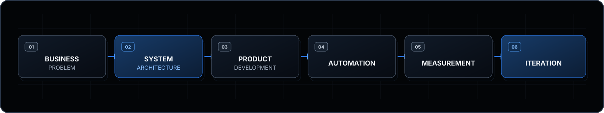

  

<h1 align="center">SOHEIL HAJI HEYDARI</h1>

  <strong>Founder, Soheil AI Systems</strong> 
  AI Systems Architect · Full-Stack Product Builder

  I design intelligent systems that connect business operations, automation, data and customer experience.

  
  
  
  
  
  

<h2>سهیل حاجی حیدری</h2>

<strong>بنیان‌گذار Soheil AI Systems</strong> معمار سیستم‌های هوش مصنوعی · سازنده محصولات فول‌استک

<strong>برای کسب‌وکارهای آنلاین، سیستم می‌سازم؛ نه ابزارهای پراکنده.</strong>

<h3>جایگاه حرفه‌ای</h3>

برای کسب‌وکارهای آنلاین، سیستم‌های یکپارچه طراحی و پیاده‌سازی می‌کنم. کار از شناخت مدل عملیاتی کسب‌وکار، مسیر حرکت اطلاعات، نقاط اتلاف زمان و تصمیم‌هایی که به داده دقیق‌تر نیاز دارند آغاز می‌شود؛ نه از انتخاب زودهنگام یک فناوری.

بر اساس این مدل عملیاتی، معماری نرم‌افزار و محصول متصل به آن را می‌سازم: سرویس‌های بک‌اند، پلتفرم‌های کاربرمحور، اتوماسیون، گردش‌کارهای مجهز به هوش مصنوعی، پردازش داده و زیرساخت استقرار. خروجی، سیستمی منسجم، قابل‌اندازه‌گیری، قابل‌نگهداری و قابل‌توسعه است.

<h3>سیستم‌هایی که می‌سازم</h3>

<h4>۰۱ · اتوماسیون هوشمند کسب‌وکار</h4>

سیستم‌هایی برای کاهش کارهای تکراری، هماهنگی انتقال وظایف و اتصال فرایندهای پراکنده در یک گردش‌کار قابل‌اتکا.

<h4>۰۲ · مدیریت ارتباط با مشتری و عملیات سرنخ</h4>

سیستم‌هایی برای ثبت، سازمان‌دهی، مسیردهی و پیگیری سرنخ‌ها، همراه با مسئولیت مشخص و سنجش‌پذیری در مسیر مشتری.

<h4>۰۳ · دستیارهای هوشمند و محصولات گردش‌کار</h4>

محصولات مجهز به هوش مصنوعی برای عملیات محتوا، ارتباط با مشتری، فرایندهای داخلی و پشتیبانی تصمیم؛ با درنظرگرفتن نظارت انسانی و زمینه واقعی عملیات.

<h4>۰۴ · پلتفرم‌های وب و سیستم‌های مدیریتی</h4>

پلتفرم‌های کامل وب، داشبوردها، سیستم‌های رزرو، جریان‌های پرداخت و پنل‌های عملیاتی که تجربه مشتری را به تیم اجرا متصل می‌کنند.

<h3>رویکرد من به سیستم‌ها</h3>

<strong>مسئله کسب‌وکار ← معماری سیستم ← توسعه محصول ← اتوماسیون ← اندازه‌گیری ← بهبود مستمر</strong>

فناوری بر اساس فرایند کسب‌وکار، مرزهای داده، نیازهای یکپارچه‌سازی و شرایط واقعی بهره‌برداری انتخاب می‌شود. معماری پیش از ابزار قرار می‌گیرد.

<h3>پروژه‌های منتخب</h3>

<h4><a href="https://github.com/soheil78ai/Soheil-link-hub">Soheil Link Hub</a></h4>

یک پلتفرم دوزبانه معرفی و ارتباط که بازدیدکنندگان شبکه‌های اجتماعی را در مسیری روشن به خدمات، نمونه‌کارها و کانال‌های رسمی هدایت می‌کند.

<ul>
  <li><strong>قابلیت سیستم:</strong> مدیریت متمرکز محتوا و لینک، پشتیبانی RTL/LTR، طراحی واکنش‌گرا، دسترس‌پذیری، فراداده SEO و استقرار خودکار</li>
  <li><strong>فناوری‌های تأییدشده:</strong> React، TypeScript، Vite، CSS اختصاصی، GitHub Actions و GitHub Pages</li>
</ul>

<h4><a href="https://github.com/soheil78ai/soheil-ai-cinematic-prompts">AI Cinematic Workflow Library</a></h4>

محصولی مبتنی بر سناریو برای سازمان‌دهی تولید محتوای مجهز به هوش مصنوعی بر اساس هدف تجاری، منابع مرجع، تنظیمات اجرا و کنترل کیفیت.

<ul>
  <li><strong>قابلیت سیستم:</strong> ماژول‌های سناریویی قابل‌استفاده مجدد، راهنمای تولید ساختاریافته، تحویل دارایی و انتشار واکنش‌گرا</li>
  <li><strong>فناوری‌های تأییدشده:</strong> HTML، CSS، JavaScript، GitHub Actions و GitHub Pages</li>
</ul>

سیستم‌های عملیاتی مشتریان برای حفاظت از داده‌ها و مالکیت فکری خصوصی باقی می‌مانند. خلاصه‌های معماری و مطالعات موردی بدون اطلاعات محرمانه در <a href="https://soheilai.com/portfolio">نمونه‌کارها</a> منتشر می‌شوند.

<h3>زیرساخت مهندسی</h3>

<ul>
  <li><strong>بک‌اند:</strong> Python · FastAPI · SQLAlchemy · REST APIs</li>
  <li><strong>فرانت‌اند:</strong> JavaScript · TypeScript · React · Next.js · HTML · CSS</li>
  <li><strong>داده و زیرساخت:</strong> PostgreSQL · Redis · Docker · Nginx · GitHub Actions</li>
  <li><strong>هوش مصنوعی و اتوماسیون:</strong> OpenAI APIs · اتصال Telegram و Bale · اتوماسیون گردش‌کار · پردازش داده</li>
</ul>

<h3>فعالیت گیت‌هاب</h3>

نمای سه‌بعدی فعالیت‌های عمومی گیت‌هاب در بخش GitHub Activity صفحه قرار دارد و به‌صورت خودکار توسط GitHub Actions به‌روزرسانی می‌شود.

<h3>ارتباط</h3>

<strong>برای ساخت یک محصول نرم‌افزاری یا سیستم عملیاتی، از معماری درست شروع کنیم.</strong>

<a href="https://soheilai.com">وب‌سایت</a> · <a href="https://soheilai.com/portfolio">نمونه‌کارها</a> · <a href="https://soheilai.com/contact">شروع گفتگو</a> · <a href="https://instagram.com/soheil.aisystems">اینستاگرام</a> · <a href="https://t.me/SoheilAIsystems">تلگرام</a> · <a href="mailto:info@soheilai.com">ایمیل</a>

---

## Core Positioning

I build end-to-end systems for online businesses. The work starts with understanding how an operation creates value, where information moves, what slows the team down and which decisions need better data—not with a predetermined technology stack.

From that operating model, I design the software architecture and deliver the connected product: backend services, user-facing platforms, automation, AI-assisted workflows, data pipelines and deployment infrastructure. The result is a coherent system that can be measured, maintained and extended.

## Systems I Build

### 01 · Intelligent Business Automation

Systems that reduce repetitive work, coordinate handoffs and connect fragmented operational processes into one dependable workflow.

### 02 · CRM & Lead Operations

Systems for capturing, organizing, routing and following up leads, with clear ownership and measurement across the customer journey.

### 03 · AI Assistants & Workflow Products

AI-assisted products for content operations, customer communication, internal workflows and decision support, designed around human review and operational context.

### 04 · Web Platforms & Admin Systems

End-to-end web platforms, dashboards, booking systems, payment flows and operational panels that connect customer-facing experiences with the teams running them.

## How I Think About Systems

  

Technology selection follows the business process, data boundaries, integration requirements and the conditions under which the system must operate. Architecture comes before tooling.

## Selected Work

### [Soheil Link Hub](https://github.com/soheil78ai/Soheil-link-hub)

> A bilingual product and contact platform that gives social-media visitors a structured path to services, selected work and official channels.

- **System capability:** centralized content and link configuration, RTL/LTR localization, responsive interaction design, accessibility controls, SEO metadata and automated deployment
- **Verified technologies:** React, TypeScript, Vite, custom CSS, GitHub Actions, GitHub Pages

### [AI Cinematic Workflow Library](https://github.com/soheil78ai/soheil-ai-cinematic-prompts)

> A scenario-based workflow product for organizing AI-assisted content production around business purpose, references, execution settings and quality controls.

- **System capability:** reusable scenario modules, structured production guidance, asset delivery, copy-ready workflow inputs and responsive static publishing
- **Verified technologies:** HTML, CSS, JavaScript, GitHub Actions, GitHub Pages

Production client systems remain private to protect client data and intellectual property. Public architecture summaries and sanitized case studies are available through the [portfolio](https://soheilai.com/portfolio).

## Engineering Foundation

Technology supports the system; it does not define the system.

- **Backend** — Python · FastAPI · SQLAlchemy · REST APIs
- **Frontend** — JavaScript · TypeScript · React · Next.js · HTML · CSS
- **Data & Infrastructure** — PostgreSQL · Redis · Docker · Nginx · GitHub Actions
- **AI & Automation** — OpenAI APIs · Telegram integrations · Bale integrations · workflow automation · data processing

## GitHub Activity

  
   
  Public contribution activity · generated and refreshed by GitHub Actions

## Contact

### Building a software product or an operational system?

**Let’s start with the architecture.**

[Website](https://soheilai.com) · [Portfolio](https://soheilai.com/portfolio) · [Contact](https://soheilai.com/contact) · [Instagram](https://instagram.com/soheil.aisystems) · [Telegram](https://t.me/SoheilAIsystems) · [Email](mailto:info@soheilai.com)

